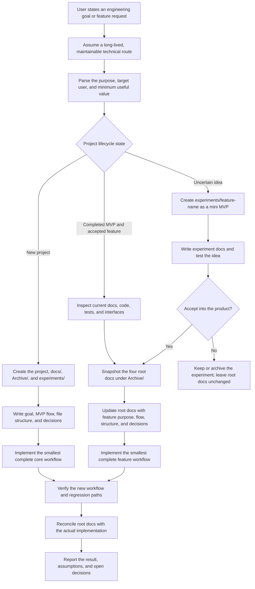

# Scaffold MVP Project

[English](README.md) | [简体中文](README.zh-CN.md)

Codex skill for turning a broad engineering goal into a concrete project folder with a lightweight MVP planning package, then continuing the same workflow for accepted post-MVP features.

When this skill is used, Codex should first assume a long-lived maintainable technical route, parse the user's purpose, scaffold the project workspace, create `docs/` and `Archive/`, write the core MVP planning files, and document the proposed file structure before implementation begins.

MVP means using one long-lived, maintainable technical route that should remain valid as the project grows, then implementing the smallest core capability that serves the user's purpose. Later features reuse that route, define the next minimum useful increment, and update the root docs before implementation.

## Workflow



## Contents

```text
.
├── SKILL.md
├── agents/
│   └── openai.yaml
└── scripts/
    ├── scaffold_mvp_project.py
    └── validate_mvp_docs.py
```

## What It Creates

For a new project:

```text
my-project/
├── docs/
│   ├── goal.md
│   ├── mvp-flow.md
│   ├── file-structure.md
│   └── decisions.md
├── Archive/
└── experiments/
```

For an experimental feature:

```text
my-project/
└── experiments/
    └── faster-import/
        ├── Archive/
        └── docs/
            ├── goal.md
            ├── mvp-flow.md
            ├── file-structure.md
            └── decisions.md
```

Each experiment is treated as its own mini MVP before it is merged into the main project plan.

For an accepted feature after the MVP, the skill snapshots the current docs under `Archive/` and incrementally updates the four root docs. Experimental ideas continue to use `experiments/` until they are accepted into the product direction.

## Script Usage

Create a project scaffold:

```bash
python scripts/scaffold_mvp_project.py \
  --name my-project \
  --goal "Build a local search tool" \
  --dest .
```

Add an experimental feature scaffold:

```bash
python scripts/scaffold_mvp_project.py \
  --name my-project \
  --dest . \
  --experiment faster-import \
  --experiment-goal "Try a faster import flow" \
  --experiment-only
```

Update the existing project docs for an accepted post-MVP feature:

```bash
python scripts/scaffold_mvp_project.py \
  --name my-project \
  --dest . \
  --feature saved-searches \
  --feature-goal "Let users rerun a saved search"
```

The command archives the previous docs and inserts marked planning blocks. Complete the TODOs and reconcile the root goal, workflow, file tree, and decisions so they remain the current source of truth.

Validate the project docs:

```bash
python scripts/validate_mvp_docs.py ./my-project
```

Validate the project docs and all experiment docs:

```bash
python scripts/validate_mvp_docs.py ./my-project --experiments
```

Validate one accepted feature:

```bash
python scripts/validate_mvp_docs.py ./my-project --feature saved-searches
```

## Installing As A Codex Skill

Clone this repository into your Codex skills directory:

```bash
git clone https://github.com/silent1ball-gg/scaffold-mvp-project.git \
  ~/.codex/skills/scaffold-mvp-project
```

Then invoke it with:

```text
Use $scaffold-mvp-project to plan a maintainable MVP or continue a completed MVP with a new feature, updating the project docs before implementation.
```
