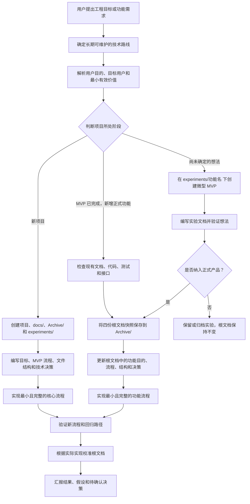

# Scaffold MVP Project

[English](README.md) | [简体中文](README.zh-CN.md)

这是一个 Codex Skill，用于将宽泛的工程目标转化为具体的项目目录和轻量级 MVP 规划文档，并在 MVP 完成后，继续用同一套流程迭代已经确认要加入的正式功能。

使用此 Skill 时，Codex 会先确定一条长期可维护的技术路线，再解析用户的真实目的、创建项目工作区、建立 `docs/` 和 `Archive/`、编写核心 MVP 规划文件，并在开始实现前说明项目文件结构。

这里的 MVP 是指：采用一条随着项目发展仍然有效、不会被完全推翻的技术路线，然后先实现能够满足用户目的的最小核心能力。后续新增功能继续沿用这条路线，定义下一个最小可用增量，并在实现前更新根目录下的文档。

## 工作流程



## 仓库内容

```text
.
├── SKILL.md
├── agents/
│   └── openai.yaml
└── scripts/
    ├── scaffold_mvp_project.py
    └── validate_mvp_docs.py
```

## 创建的内容

新项目结构：

```text
my-project/
├── docs/
│   ├── goal.md
│   ├── mvp-flow.md
│   ├── file-structure.md
│   └── decisions.md
├── Archive/
└── experiments/
```

实验功能结构：

```text
my-project/
└── experiments/
    └── faster-import/
        ├── Archive/
        └── docs/
            ├── goal.md
            ├── mvp-flow.md
            ├── file-structure.md
            └── decisions.md
```

每个实验都会先作为独立的微型 MVP 进行规划和验证，确认后再合并到主项目规划中。

对于 MVP 完成后确认要加入的正式功能，Skill 会先把当前文档快照保存到 `Archive/`，然后增量更新四份根文档。尚未确定的想法继续保留在 `experiments/` 中，直到它被正式纳入产品方向。

## 脚本用法

创建项目脚手架：

```bash
python scripts/scaffold_mvp_project.py \
  --name my-project \
  --goal "构建一个本地搜索工具" \
  --dest .
```

创建实验功能脚手架：

```bash
python scripts/scaffold_mvp_project.py \
  --name my-project \
  --dest . \
  --experiment faster-import \
  --experiment-goal "尝试更快的导入流程" \
  --experiment-only
```

为 MVP 完成后确认加入的正式功能更新现有项目文档：

```bash
python scripts/scaffold_mvp_project.py \
  --name my-project \
  --dest . \
  --feature saved-searches \
  --feature-goal "让用户可以重新运行已保存的搜索"
```

该命令会归档之前的文档，并向四份根文档插入带标记的功能规划区块。随后需要完成所有 TODO，并校准项目目标、工作流程、文件树和技术决策，使根文档始终描述项目当前状态，而不只是充当变更日志。

验证项目文档：

```bash
python scripts/validate_mvp_docs.py ./my-project
```

验证项目文档和全部实验文档：

```bash
python scripts/validate_mvp_docs.py ./my-project --experiments
```

验证指定的正式功能：

```bash
python scripts/validate_mvp_docs.py ./my-project --feature saved-searches
```

## 安装为 Codex Skill

将此仓库克隆到 Codex Skills 目录：

```bash
git clone https://github.com/silent1ball-gg/scaffold-mvp-project.git \
  ~/.codex/skills/scaffold-mvp-project
```

然后可以这样调用：

```text
使用 $scaffold-mvp-project 规划一套长期可维护的 MVP；如果 MVP 已完成，则继续规划新增功能，并在实现前更新项目文档。
```
